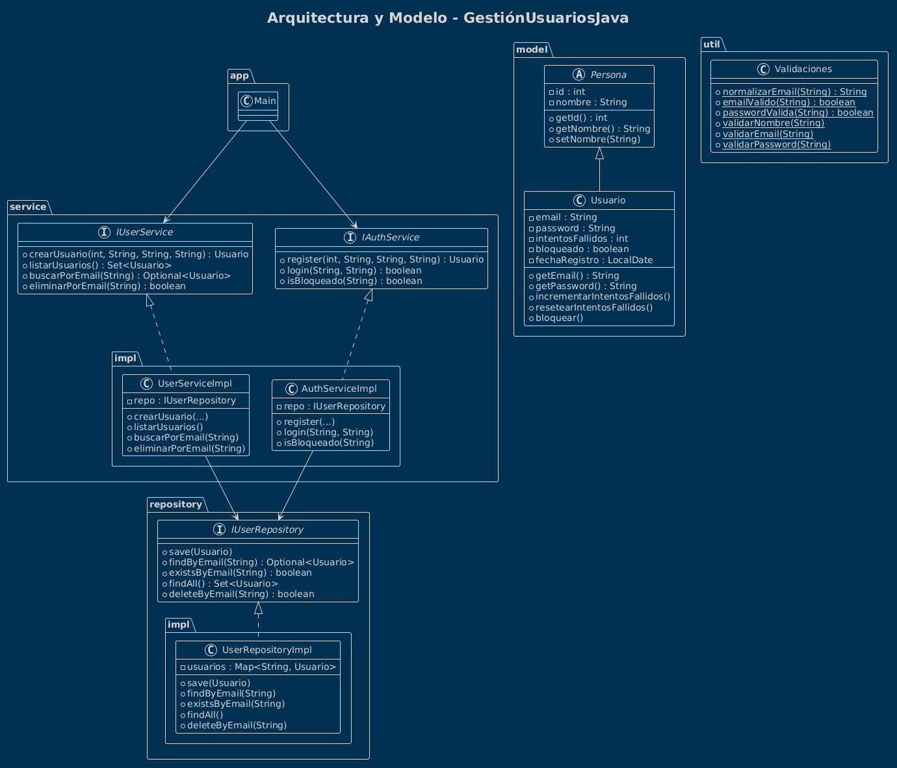

# 📘 **Gestión de Usuarios en Java**

Sistema de autenticación y gestión de usuarios por consola, desarrollado con arquitectura por capas y buenas prácticas de programación orientada a objetos para la asignatura de programacion del ciclo superior de formacion profesional de DAM.

---

## 📌 Descripción del proyecto

Este proyecto implementa un sistema completo de **registro, autenticación y gestión de usuarios**, aplicando:

- Arquitectura por capas  
- Validaciones con expresiones regulares  
- Encapsulación y herencia  
- Manejo de excepciones  
- Colecciones (`Set`, `Map`)  
- Separación estricta de responsabilidades  
- Diseño limpio y mantenible  

El sistema funciona por consola y permite:

- Registrar usuarios  
- Iniciar sesión  
- Controlar intentos fallidos  
- Bloquear usuarios tras 3 fallos  
- Listar usuarios  
- Buscar por email  
- Eliminar usuarios  

---

## 🧱 Arquitectura del proyecto

```
src/main/java/com/docencia/
 ├── app/               → Capa de presentación (consola)
 ├── model/             → Entidades del dominio
 ├── util/              → Validaciones y utilidades
 ├── repository/        → Interfaces de acceso a datos
 ├── repository/impl/   → Implementación en memoria
 ├── service/           → Interfaces de lógica de negocio
 └── service/impl/      → Implementación de servicios
```

---

## 🧩 Explicación de capas

### **1. app (presentación)**
- Contiene el menú por consola.
- No implementa lógica de negocio.
- Solo interactúa con los servicios.

### **2. model (dominio)**
- `Persona` (abstracta): id, nombre, validaciones básicas.
- `Usuario`: extiende Persona, añade email, password, intentos, bloqueo, fecha de registro.

### **3. util**
- Clase `Validaciones` con métodos estáticos:
  - Validación de email (RegEx)
  - Validación de contraseña
  - Normalización de email

### **4. repository**
- `IUserRepository`: CRUD básico.
- `UserRepositoryImpl`: almacenamiento en memoria mediante `Set` o `Map`.

### **5. service**
- `IUserService`: gestión CRUD de usuarios.
- `IAuthService`: registro y login.
- Implementaciones aplican reglas de negocio:
  - Evitar duplicados  
  - Bloqueo tras 3 fallos  
  - Reset de intentos al loguear correctamente  

---

## 🧬 UML del proyecto

  

---

## 🚀 Cómo ejecutar el proyecto

### **1. Clonar el repositorio**
```bash
git clone https://github.com/IvnMD/GestionUsuariosJava.git
cd GestionUsuariosJava
```

### **2. Compilar**
```bash
mvn clean install
```

### **3. Ejecutar**
Desde el IDE o con:

```bash
mvn exec:java -Dexec.mainClass="com.docencia.app.Main"
```

---

## 🖥️ Uso del programa

Al ejecutar, verás un menú como:

```
1. Registrar usuario
2. Iniciar sesión
3. Listar usuarios
4. Buscar por email
5. Eliminar usuario
6. Salir
```

### ✔ Registro
- Valida email  
- Valida contraseña  
- Evita duplicados  

### ✔ Login
- Si la contraseña es incorrecta → suma intento  
- Tras 3 fallos → usuario bloqueado  
- Usuario bloqueado no puede acceder  

---

## 📂 Estructura del código (resumen)

```
src/
 ├── com.docencia.app/
 │    └── Main.java 
 ├── com.docencia.model/
 │    ├── Persona.java
 │    └── Usuario.java
 ├── com.docencia.util/
 │    └── Validaciones.java
 ├── com.docencia.repository/
 │    └── IUserRepository.java
 ├── com.docencia.repository.impl/
 │    └── UserRepositoryImpl.java
 ├── com.docencia.service/
 │    ├── IAuthService.java
 │    └── IUserService.java
 └── com.docencia.service.impl/
      ├── AuthServiceImpl.java
      └── UserServiceImpl.java
```


---

## 🎯 Conclusión

Este proyecto es una excelente base para aprender:

- Arquitectura por capas  
- Buenas prácticas de OOP  
- Validaciones y normalización  
- Gestión de usuarios  
- Diseño limpio y mantenible

---

## 📜 Licencia

Este proyecto está bajo licencia **Apache-2.0**.
